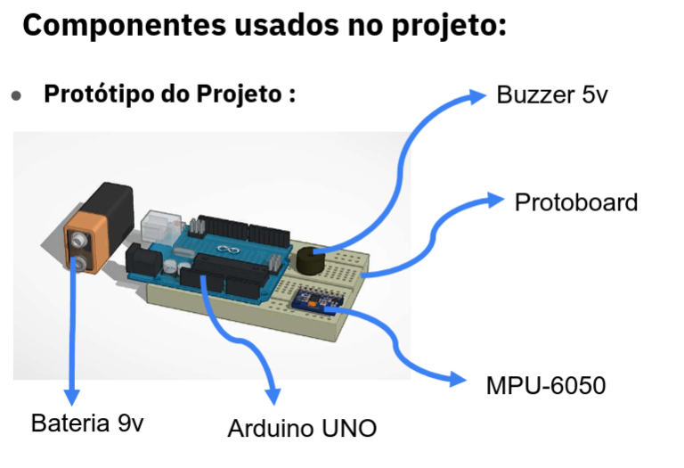
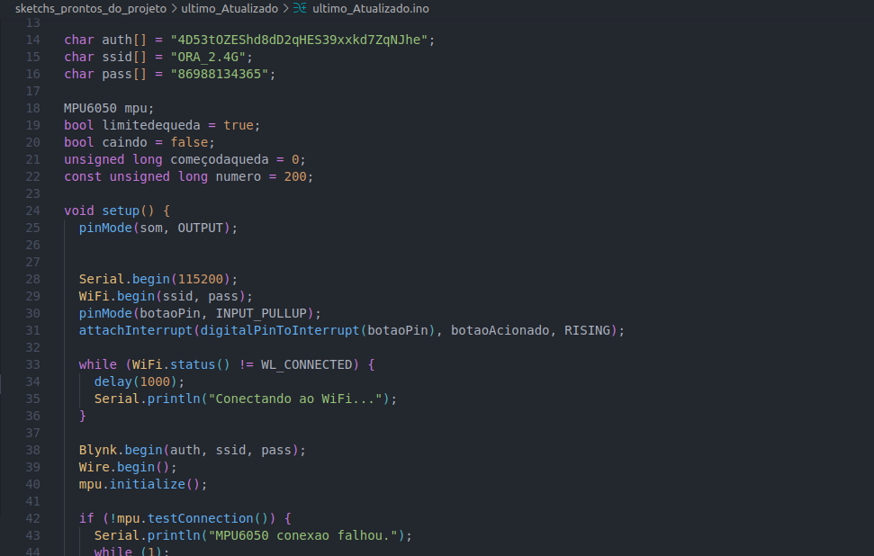
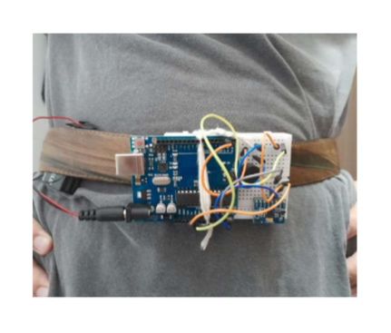
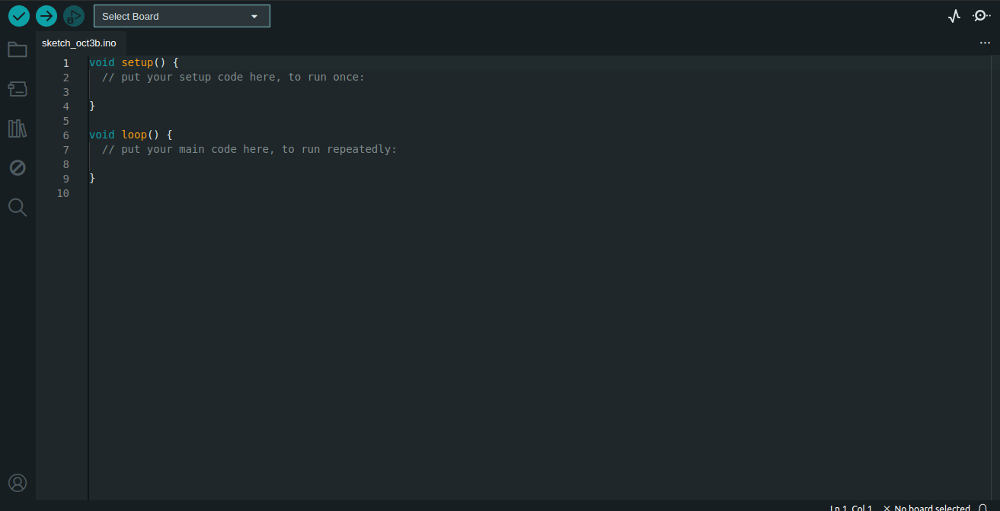
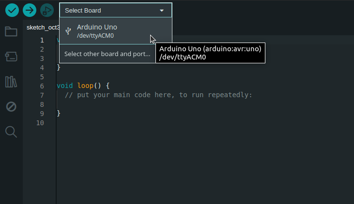
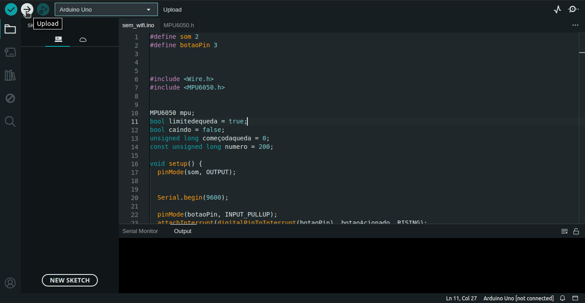

 
<h1 align="center">Sensor de Quedas: Tecnologia Vestível para Idosos Protótipo Eletrônico de Detecção de Quedas</h1>

## Sumário

* [Introdução](#Introdução)
* [Componentes usados no Prototipo](#Componentes-usados-no-Prototipo)
* [Desenvolvimento do Programa](#Desenvolvimento-do-Programa)
* [Resultados Obtidos](#Resultados-Obtidos)
* [Como_Usar](#Como_Usar)
* [Conclusão](#conclusão)

## Introdução
Para esse bimestre, nós tínhamos que trabalhar com hardware e software, enquanto simultaneamente continuamos nosso projeto voltado para idosos, então decidimos fazer um protótipo de sensor de queda, a fim de aproveitar as funcionalidades do Arduino para beneficiar os idosos para terem melhor segurança e bem-estar. Apesar das dificuldades encontradas durante o desenvolvimento do protótipo, conseguimos um bom resultado, através de uma pesquisa extensiva, explorando documentos, artigos científicos e vídeos.

---

## Componentes usados no Prototipo 

 

- Buzzer 5v -> Para aviso sonoro.
- Protoboard de 300 pinos -> Usado para expandir as conecçoes entre os compoenentes e usar como base do prototipo.
- Arduino Uno -> Um Microcontrolador, onde armazena um nosso codigo e processa todas as tarefas.
- MPU-6050 -> É um acelerômetro e giroscópio capaz de medir a aceleração e rotação nos três eixos coordenados (x,y,z).
- Bateria 9v -> Fonte de energia do dispositivo.

---

## Desenvolvimento do Programa

 

Parte do codigo

- O programa analisa os dados do mpu6050 e calcula atraves da aceleraçao o movimento brusco e o angulo do dispositivo.
- O codigo funciona com dois estagios para detecçao de queda.
  - 1º Estagio verifica a condiçao de movimento brusco.
  - 2º Estagio verifica a condiçao de uma real queda.

---

## Resultados Obtidos 

 

Aqui está uma versão aprimorada da frase para o README, com uma linguagem mais formal e clara:

---

## Como_Usar

> Além do hardware, é necessário o software para executar o programa no microcontrolador.

### 1. Instale o Arduino IDE

- Acesse o site oficial do [Arduino](https://www.arduino.cc/) e faça o download da IDE.
- Inicie o Programa

 

### 2. Abra o Arquivo

Na plataforma Arduino IDE, abra o arquivo localizado na pasta correspondente ao projeto.

 

### 3. Configurações

- Ao tentar rodar o script no Arduino UNO, caso a plataforma sugira configurações adicionais, aceite as recomendações fornecidas.

- Selecione a placa conectada ao computador

 

---

### 4. Pronto! click em Upload para Placa

 

## Conclusão

O protótipo de sensor de queda para idosos uniu hardware e software, utilizando o Arduino Uno e o sensor MPU-6050 para detectar movimentos bruscos e quedas reais. Apesar dos desafios técnicos, o projeto alcançou bons resultados, mostrando potencial para melhorar a segurança e qualidade de vida dos idosos. As próximas etapas envolvem possíveis melhorias e refinamentos do dispositivo.
